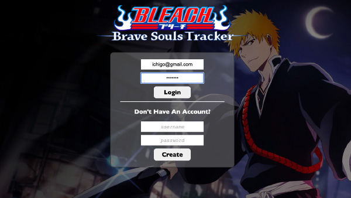
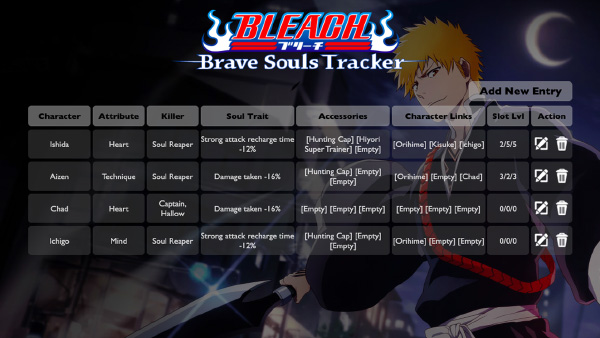

# Bleach Brave Souls Tracker
 
This application is an organizer to help fans of Bleach Brave Souls track the numerous amount of characters that they have collected.

 ---
 
 
 
 
 ---
## Languages & Tools

What was used:
- Javascript
- HTML
- CSS
- Photoshop
- Node.js, MongoDB, Mongoose, Express, Cors, Bcrypt, JSON Web Token, Passport-JWT 

## How it Works
 ---
 1. &nbsp; Add entries of characters you are working on in BBS.
 2. &nbsp; The Name, Attribute, Killer, and Soul Trait Field are Required to Create.
 3. &nbsp; The Brackets around the Accessory and Character Links represent the Slot.
 4. &nbsp; All Entries added are Unique to the User.

---
## FUTURE UPDATES

### Version 2.0
- As a user, I want a Search Bar.
- As a user, I want a way to Filter the list of Characters I Added through Tabs.

### Version 3.0
- As a user, I want some of these fields to have a drop down menu instead of manually entering in the Data.
- As a user, I want some of these fields that were picked from the drop down menu to instantiate an image to give a better representation of what has been picked.